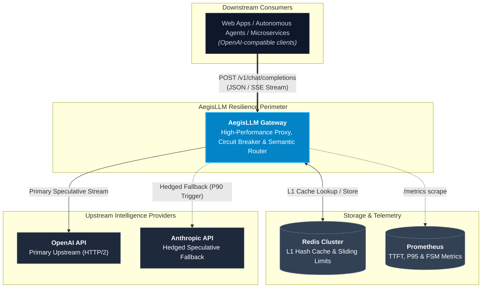
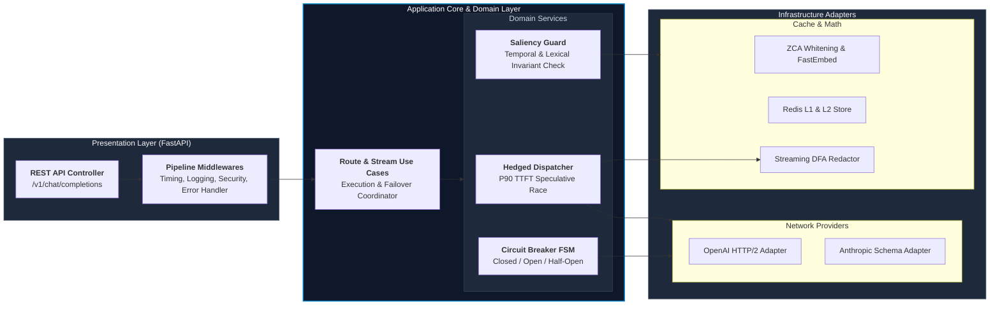

# AegisLLM Gateway

> **Production-grade, resilient, observable LLM Gateway built with Hexagonal Architecture.**

AegisLLM is an enterprise gateway designed to protect against downstream model outages, eliminate vendor lock-in, slash LLM inferencing costs via a two-tier caching strategy (exact SHA-256 + ONNX semantic embeddings), and guarantee 99.99% availability via state-machine circuit breakers.

---

## Architecture Overview (C4 Model)

### System Context Diagram (Level 1)



### Container Diagram (Level 2 — Hexagonal Architecture)



---

## Core Capabilities

- **Hexagonal Architecture (Ports and Adapters):** Domain layer has zero external framework dependencies. Core entities and business rules are completely decoupled from FastAPI, HTTPX, and third-party SDKs.
- **Circuit Breaker Pattern:** Isolated 3-state finite state machine (`CLOSED`, `OPEN`, `HALF_OPEN`) per provider prevents cascading failures and provides instant failover.
- **Two-Tier Caching:**
  - **L1 Exact Cache:** Sub-millisecond SHA-256 hash match via In-Memory / Redis.
  - **L2 Semantic Cache:** Embedding generation via local ONNX runtime (`FastEmbed` `all-MiniLM-L6-v2`) and Cosine Similarity thresholding (> 0.90).
- **Streaming over SSE:** Native, non-blocking Server-Sent Events (`stream=True`) with automatic disconnect handling and resource cleanup.
- **Deep Observability:** Prometheus metrics (`p50`, `p95`, `p99` latency, cache hit ratios, token usage counters) and OpenTelemetry spans.

---

## Project Structure

```
├── docs/
│   └── adr/                   # Architecture Decision Records
│       └── 0001-hexagonal-architecture-and-resilience.md
├── src/
│   ├── domain/                # Pure interfaces (Protocols) & Pydantic models
│   │   ├── exceptions.py      # Domain-specific error hierarchy
│   │   ├── models/            # Chat, Provider, CircuitBreaker models
│   │   └── ports/             # LLMProviderPort, CachePort, MetricsPort
│   ├── application/           # Use cases & orchestration services
│   │   ├── use_cases/         # RouteChatCompletionUseCase, StreamChatCompletionUseCase
│   │   └── services/          # CircuitBreakerService, SemanticCacheService
│   ├── infrastructure/        # Outbound adapters (network, DB, metrics)
│   │   ├── providers/         # OpenAIAdapter, AnthropicAdapter, MockProvider
│   │   ├── cache/             # MemoryCacheAdapter, RedisCacheAdapter
│   │   └── observability/     # PrometheusMetricsAdapter
│   └── presentation/          # Inbound API (FastAPI)
│       ├── api/v1/endpoints/  # /chat/completions
│       └── middlewares/       # Logging, Timing, ErrorHandling
├── tests/
│   ├── unit/                  # Unit tests (Domain, CB, Cache)
│   ├── integration/           # Integration tests with provider mocks
│   └── load/                  # k6 load testing scripts
├── Dockerfile
├── docker-compose.yml
├── pyproject.toml             # Ruff, Mypy (strict mode), Pytest
├── Makefile
└── README.md
```

---

## Quickstart

### Prerequisites
- Python 3.11+
- [uv](https://docs.astral.sh/uv/) (recommended) or pip

```bash
# Clone and enter workspace
git clone <repo-url> aegisllm && cd aegisllm

# Setup virtual environment and install dev dependencies
make dev

# Run strict type checking
make typecheck

# Run unit tests
make test-unit

# Start the gateway
make run
```
