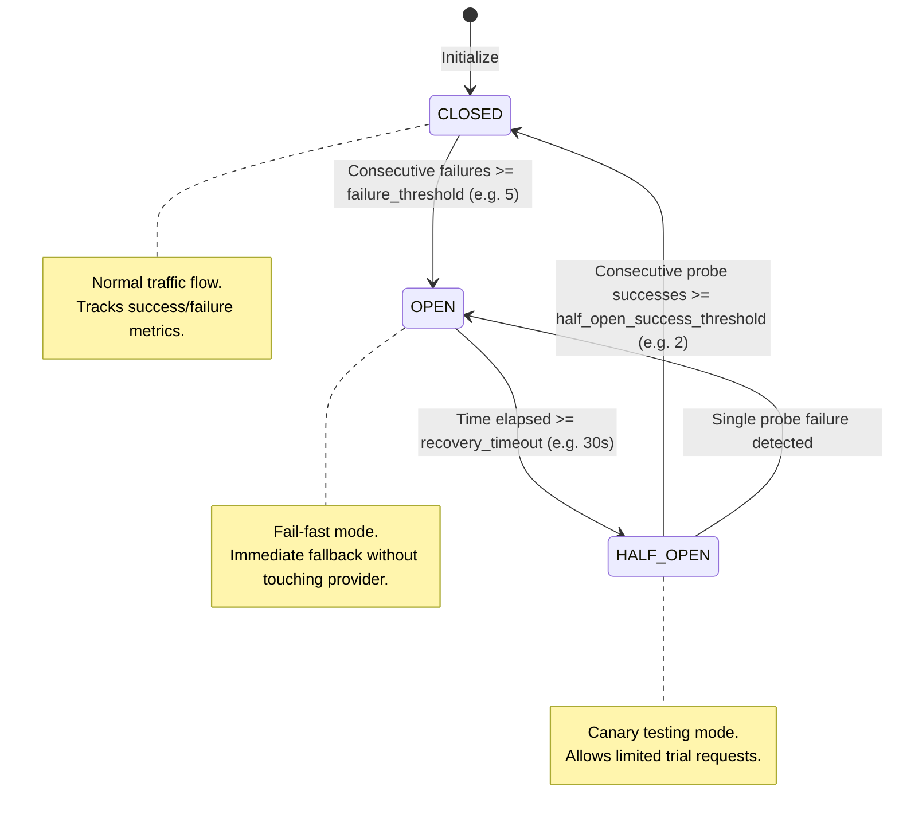
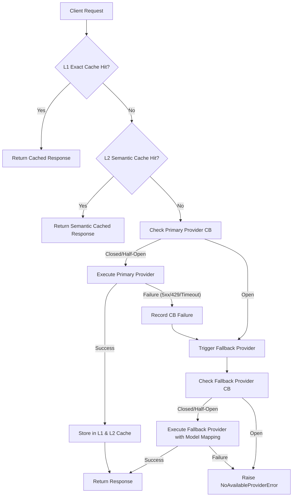

# ADR 0001: Hexagonal Architecture and Resilience Strategy for AegisLLM Gateway

- **Status:** Accepted
- **Date:** 2026-10-02
- **Author:** Principal Software Architect
- **Deciders:** Core Engineering Team

---

## 1. Context and Problem Statement

Enterprise systems leveraging Large Language Models (LLMs) face critical operational challenges:
1. **Upstream Fragility & Latency Spikes:** Commercial LLM APIs experience frequent degradations, throttling (HTTP 429), connection dropouts, and catastrophic downtime.
2. **Vendor Lock-in:** Tightly coupling backend applications to a single provider SDK (such as `openai-python` or `anthropic-python`) impedes rapid switching to more cost-effective or resilient alternatives.
3. **Escalating Costs & Redundant Computation:** A significant portion of production LLM queries are repetitive or semantically identical, generating redundant inference costs and user latency.
4. **Maintainability & Architectural Decay:** Gateway services frequently devolve into "Smart UI / Fat Controller" anti-patterns, mixing routing logic, HTTP parsing, retry loops, and caching in API handlers.

AegisLLM requires an enterprise-grade architectural foundation that guarantees:
- Absolute separation between core business rules, external network protocols, and third-party APIs.
- Autonomous fault isolation and failover without service disruption.
- Full protocol compatibility with the standard OpenAI `/v1/chat/completions` specification.

---

## 2. Decision Drivers

- **High Availability (99.99% Target):** Downstream clients must be shielded from individual provider outages.
- **Latency Optimization:** Sub-millisecond exact cache lookups and fast semantic matching (<15ms) to bypass external round-trips.
- **Testability & Determinism:** All routing, state machines, and failovers must be fully testable with pure in-memory unit tests without spawning external mock HTTP servers.
- **Strict Typing & Domain Purity:** Zero framework or vendor dependencies within the core domain layer.

---

## 3. Considered Options

1. **Option 1: Monolithic FastAPI Service with Inline HTTPX Client Calls**
   - *Pros:* Simple to write initially, rapid prototype.
   - *Cons:* Severe architectural coupling, untestable edge cases, impossible to maintain as providers proliferate.
2. **Option 2: Service Mesh / Reverse Proxy (Envoy / Kong) with Custom Lua Scripts**
   - *Pros:* Offloads networking resilience to infrastructure.
   - *Cons:* Lacks deep domain intelligence required for payload transformations (e.g. OpenAI to Anthropic schema), semantic embedding caching (ONNX FastEmbed), and token usage accounting.
3. **Option 3: Hexagonal Architecture (Ports and Adapters) with DDD Principles (SELECTED)**
   - *Pros:* Decouples domain logic from infrastructure; ports defined via Python `typing.Protocol`; domain models validate data without external network dependencies; infrastructure adapters can be swapped or mocked seamlessly.
   - *Cons:* Requires upfront architectural discipline and boilerplate interface definitions.

---

## 4. Decision: Hexagonal Architecture & Resilience Foundation

We choose **Option 3: Hexagonal Architecture (Ports and Adapters)** combined with Domain-Driven Design principles.

### 4.1 Layer Responsibilities

```
+--------------------------------------------------------------------------+
|                        Presentation Layer (Inbound)                      |
|           FastAPI Endpoints, SSE Streaming Response, Middlewares         |
+--------------------------------------------------------------------------+
                                    |
                                    v
+--------------------------------------------------------------------------+
|                         Application Layer (Use Cases)                    |
|   RouteChatCompletionUseCase, StreamChatCompletionUseCase                |
|   CircuitBreakerService, SemanticCacheService                            |
+--------------------------------------------------------------------------+
                                    |
                                    v
+--------------------------------------------------------------------------+
|                       Domain Layer (Core Entities & Ports)               |
|   Models: ChatCompletionRequest, ChatCompletionResponse, ProviderConfig  |
|   Ports:  LLMProviderPort, L1CachePort, L2SemanticCachePort, MetricsPort |
|   State:  CircuitBreakerState (Closed, Open, Half-Open)                  |
+--------------------------------------------------------------------------+
                                    ^
                                    |
+--------------------------------------------------------------------------+
|                       Infrastructure Layer (Outbound Adapters)           |
|   Providers:      OpenAIAdapter, AnthropicAdapter, MockProvider          |
|   Cache:          MemoryCacheAdapter, RedisCacheAdapter                  |
|   Observability:  PrometheusMetricsAdapter, FastEmbedEmbeddingAdapter   |
+--------------------------------------------------------------------------+
```

1. **Domain Layer (`src/domain`):**
   - Pure domain models validated via Pydantic v2 (`ChatCompletionRequest`, `ChatCompletionResponse`, `ChatMessage`, `UsageInfo`).
   - Domain-level exceptions (`ProviderUnavailableError`, `CircuitBreakerOpenError`, `NoAvailableProviderError`).
   - Port contracts defined as runtime-checkable `typing.Protocol` interfaces (`LLMProviderPort`, `L1CachePort`, `L2SemanticCachePort`, `MetricsPort`, `EmbeddingPort`).
   - Zero dependencies on HTTP frameworks, databases, or third-party SDKs.

2. **Application Layer (`src/application`):**
   - Implements business use cases (`RouteChatCompletionUseCase`, `StreamChatCompletionUseCase`).
   - Orchestrates resilience workflows via `CircuitBreakerService` and two-tier cache lookup via `SemanticCacheService`.
   - Depends solely on domain models and port abstractions.

3. **Infrastructure Layer (`src/infrastructure`):**
   - Implements outbound ports:
     - `OpenAIAdapter`: HTTP/2 HTTPX client sending OpenAI requests.
     - `AnthropicAdapter`: Translates OpenAI schemas into Anthropic Messages format and vice versa.
     - `MockProvider`: Deterministic adapter for testing and offline scenarios.
     - `RedisCacheAdapter` / `MemoryCacheAdapter`: Implements exact L1 key-value caching.
     - `FastEmbedAdapter`: Local ONNX runtime embedding extraction.
     - `PrometheusMetricsAdapter`: Prometheus counters, histograms, and gauges.

4. **Presentation Layer (`src/presentation`):**
   - Inbound HTTP adapter implemented with FastAPI.
   - Endpoint `/v1/chat/completions` handling standard JSON requests and Server-Sent Events (SSE) streaming.
   - HTTP middlewares for latency tracking, distributed trace propagation, and standardized error responses.

---

## 5. Resilience Strategy: Circuit Breaker State Machine

To prevent cascading upstream failures, each LLM provider adapter is guarded by an isolated **Circuit Breaker** state machine.

### 5.1 State Machine Transitions



### 5.2 Transition Invariants
- **CLOSED State:** All requests pass to the provider. Successful requests decrement or reset failure counters. When consecutive failures reach `failure_threshold`, state immediately transitions to `OPEN`.
- **OPEN State:** All calls immediately raise `CircuitBreakerOpenError`, triggering instant fallback without waiting for upstream network timeouts. After `recovery_timeout_seconds`, the state transitions to `HALF_OPEN`.
- **HALF_OPEN State:** A strictly limited number of canary probe requests (`half_open_max_trials`) are dispatched to test provider recovery. If probes succeed (`>= half_open_success_threshold`), the breaker resets to `CLOSED`. If any probe fails, it trips back to `OPEN` for another recovery timeout period.

---

## 6. Multi-Provider Fallback Matrix

When a client requests a completion for a virtual model (e.g. `gpt-4o`), AegisLLM executes the following pipeline:



---

## 7. Consequences and Trade-offs

### 7.1 Positive
- **High Resilience:** Individual provider outages (e.g., OpenAI outage) cause instantaneous (<1ms) failover to secondary providers (e.g., Anthropic Claude).
- **Cost Reduction:** Up to 40-70% inference cost reduction on repetitive workloads via L1 exact hash and L2 semantic caching.
- **Architectural Longevity:** Business logic is completely isolated from HTTP transport details and third-party vendor SDK changes.
- **Zero Client Impact:** Downstream clients continue using standard OpenAI client libraries (`openai.OpenAI(base_url="http://aegis-gateway/v1")`).

### 7.2 Negative & Mitigations
- **Payload Translation Cost:** Transforming requests to Anthropic format adds negligible CPU time (<0.1ms).
- **Semantic Drift Risk:** Semantic cache false positives are mitigated by a conservative cosine similarity threshold (default `0.90`) and explicit client headers to bypass cache if required (`Cache-Control: no-cache`).

---

## 8. Compliance and Verification
- **Static Analysis:** Strict Mypy type-checking (`disallow_untyped_defs = true`, zero errors).
- **Code Quality:** Ruff linting and formatting enforced in CI.
- **Unit Testing:** Circuit Breaker state transitions, fallback routing, and cache keys must achieve 100% test coverage.
